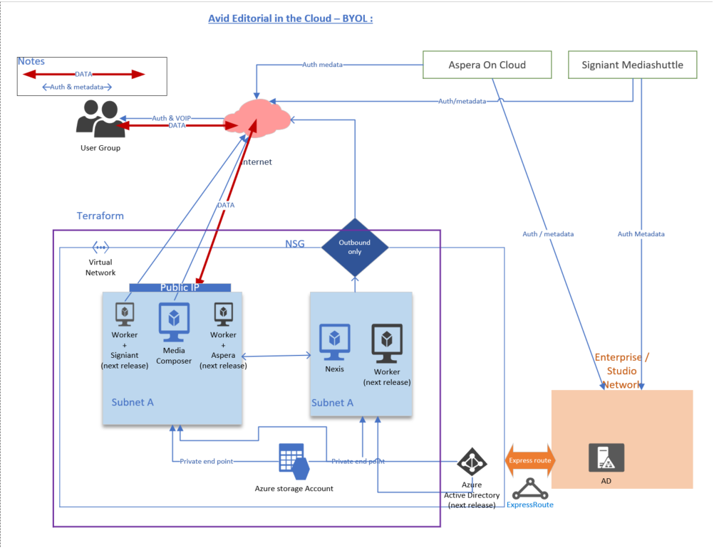

# EitC - BYOL 

Terraform templates used to deploy the following 

-Media Composer ( GPU ) with Teradici  
-Nexis (Online or Nearline)  
-Jumphost ( to access Nexis)  
in any azure subscription.  

Note : 
* Make sure you have the right GPU SKU is available in the region  

## Requirement : 

-Terraform 
-Azure subscription 
-Avid Licenses (Nexis, Media composer)
-Teradici licenses 

## Arch

## Basic installation 

#### Setup 

#### Config option

## Backlog : 
Option to apply Avid License during installation   
Setup connecting to existing Vnet / subnet  
Adding firewall rules & seperating subnets (based on security standards)  
Integrating with Azure AD for authentication  

--------------------Page break ---------------------------------------------------------------

# Avid Video Editorial In Azure Cloud

This repository covers projects related to installing Avid Editorial software in Azure subscription. 

# Project  / Folder Details 

### EitC - BYOL 
- [EitC](https://github.com/Azure/VideoEditorialInTheCloud/tree/master/EITC-BYOL) 
This Project covers installation of Media composer, Nexis and  Jump/Bastioned host in Azure subscription using terraform templates. 
Information about the ecosystem, installation guide, current version supported items and future release road map is available in the project information

### MediaComposer - BYOL 
- [MediaComposer](https://github.com/Azure/VideoEditorialInTheCloud/tree/master/EITC-BYOL) 
This project covers installation of Media Composer with Nexis storage ( online) systems in Azure subscriptions using ARM Temaplates. 
 

## Prerequisites  
- [Azure subscription] (https://portal.azure.com)
-   Avid licenses  
